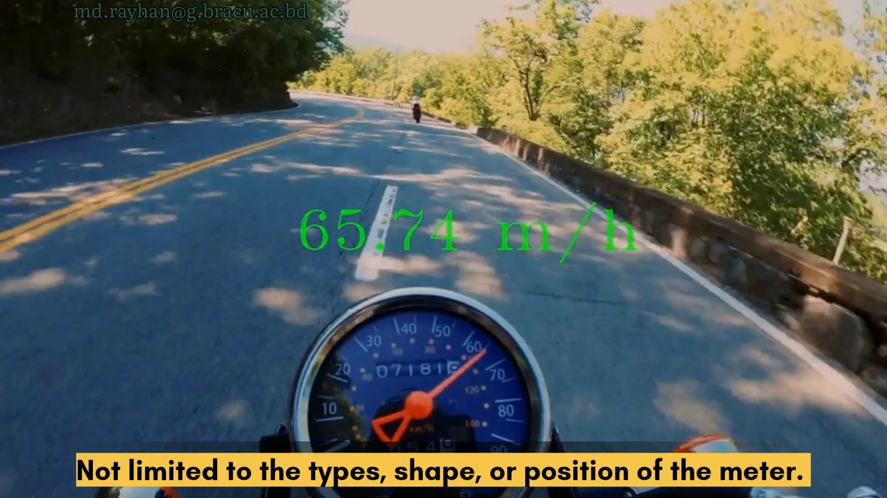

# Reading-Analog-Meter-Gauge-in-the-Wild
This is a demonstration of recognizing analog meter gauge values using computer vision deep learning models. The model is robust for real-world scenarios.

The model will soon be uploaded in this repository. At present, i am working on the other aspects of the process to enhance the efficienty of the code. I have converted the deep learning model into ONNX format to test the performance on edge devices. 

If you want to collaborate or have a position for me, please leave a message at : md.rayhan@g.bracu.ac.bd

## Thank you for your interest.
### See the video on YouTube :point_down:
___ 

